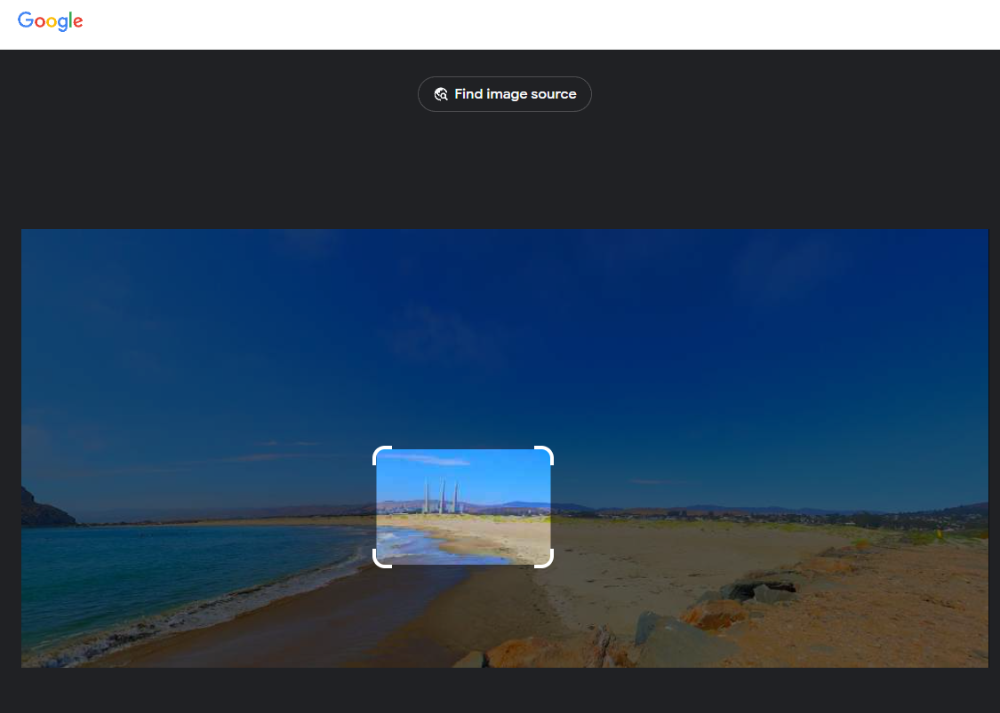
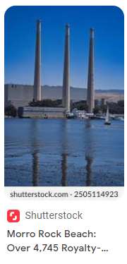
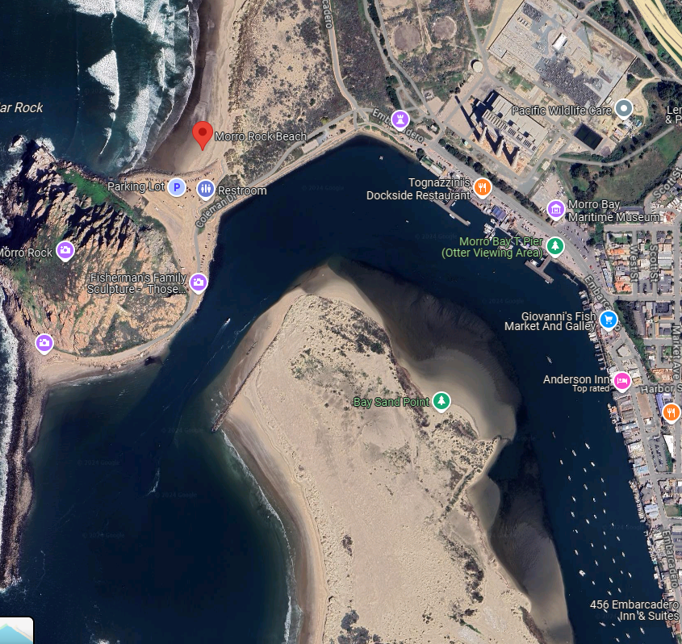
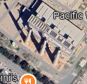
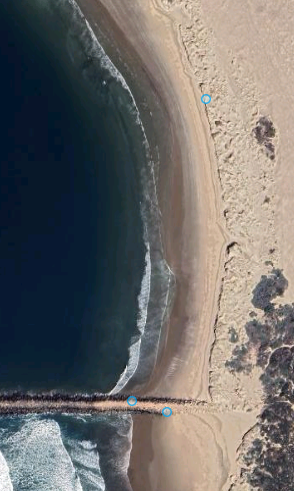
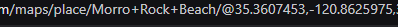
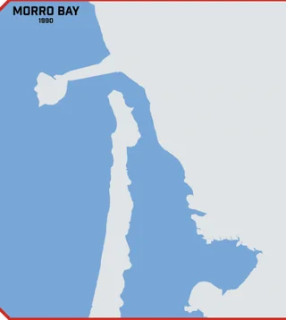
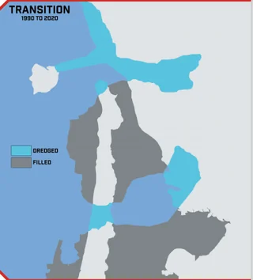

If you only select the structure you'll find its name : 

On google maps :

We can easily spot the structure : 

If we're looking at the structure, and there's a beach on our left, then that means we're somewhere here : 

Using streetview we can get our coordinates from one of the two blue circles at the bottom :

Keep 3 digits, and input the flag : 

0xGCD{35.360,-120.862}

# Alternative : Being a cyberpunk nerd

If you look at most of the challenges I've made, they're very cyberpunk themed, the description of the challenge hints that I'm talking about the founder of Night City, which is a fictional city that was built on top of Morro Rock Beach. Richard Night was a very important businessman who was murdered in his penthouse suite, in this timeline I created, he dies before he gets to build Night City :

 