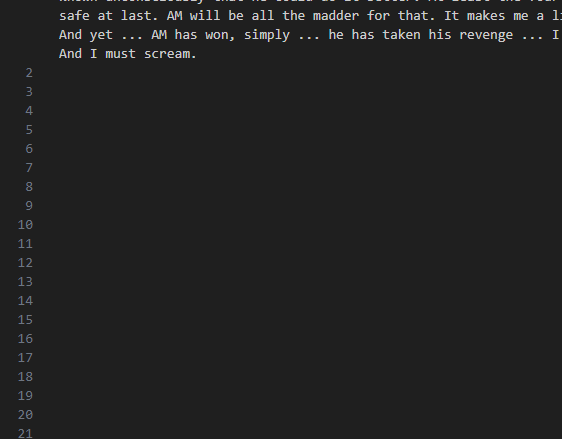

This challenge is about esoteric languages, I used whitespace language to hide information inside the text file : 

As you can see the numbers on the left indicate that these lines were used, even though they do not contain anything, unless you highlight it : 

If you copy these lines and decode them you'll get a bunch of 0s and 1s : 

0000000000000000000000000000000000000000000000000000000000000000000000000000000000000000000111000000
0000000000000000000000000000000000000000000000000000000000000000000000000000000000000000011000000000
0000000000000000000000000000000000000000000000000000000000000000000000000000000000000000110001111100
0000000000000000000000000000000000000000000000000000000000000000000000000000000000000000011110000100
0000000000000000000000000000000000000000000000000000000000000000000000000000000000000111000000011000
0000000000000000000000000000000000000000000000000000000000000000000000000000000000000001100011100000
0000000000000000000000000000000000000000000000000000000000000000000000000000000011100000011000000000
0000000000000000000000000000000000000000000000000000000000000000000000000000000000111000010000000000
0000000000000000000000000000000000000000000000000000000000000000000000000000111110001111110000000000
0000000000000000000000000000000000000000000000000000000000000000000000000001000011100000000000000000
0000000000000000000000000000000000000000000000000000000000000000000011000011000000110000000000000000
0000000000000000000000000000000000000000000000000000000000000000000001110001100000110000000000000000
0000000000000000000000000000000000000000000000000000000000000000000000011000111111100000000000000000
0000000000000000000000000000000000000000000000000000000000000000000000000110000000000000000000000000
0000000000000000000000000000000000000000000000000000000000000000011111110001100000000000000000000000
0000000000000000000000000000000000000000000000000000000000000000110000011000100000000000000000000000
0000000000000000000000000000000000000000000000000000000000000000110000001100000000000000000000000000
0000000000000000000000000000000000000000000000000000000000000000011100011000000000000000000000000000
0000000000000000000000000000000000000000000000000000011000111111000111110000000000000000000000000000
0000000000000000000000000000000000000000000000000000000111100000110000000000000000000000000000000000
0000000000000000000000000000000000000000000000000000000001100000010000000000000000000000000000000000
0000000000000000000000000000000000000000000000000000010000111000110000000000000000000000000000000000
0000000000000000000000000000000000000000000000000011101110001111000000000000000000000000000000000000
0000000000000000000000000000000000000000000000000010001111000000000000000000000000000000000000000000
0000000000000000000000000000000000000000000110000010011001111000000000000000000000000000000000000000
0000000000000000000000000000000000000000000011110000110001000000000000000000000000000000000000000000
0000000000000000000000000000000000000000000011110000011110000000000000000000000000000000000000000000
0000000000000000000000000000000000000000000000001100000000000000000000000000000000000000000000000000
0000000000000000000000000000000000000000111111000011110000000000000000000000000000000000000000000000
0000000000000000000000000000000000000001000010010000000000000000000000000000000000000000000000000000
0000000000000000000000000000000000000001101100010000000000000000000000000000000000000000000000000000
0000000000000000000000000000000000111000110000110000000000000000000000000000000000000000000000000000
0000000000000000000000000000000001101110001111000000000000000000000000000000000000000000000000000000
0000000000000000000000000000000111000011100000000000000000000000000000000000000000000000000000000000
0000000000000000000000000000011111100000110000000000000000000000000000000000000000000000000000000000
0000000000000000000000000001110000111000000000000000000000000000000000000000000000000000000000000000
0000000000000000000000000000011000001110000000000000000000000000000000000000000000000000000000000000
0000000000000000000000001110001110000000000000000000000000000000000000000000000000000000000000000000
0000000000000000000000110011100011100000000000000000000000000000000000000000000000000000000000000000
0000000000000001000001100000110000000000000000000000000000000000000000000000000000000000000000000000
0000000000000001110001100000010000000000000000000000000000000000000000000000000000000000000000000000
0000000000000000011000110001100000000000000000000000000000000000000000000000000000000000000000000000
0000000000000000000110001110000000000000000000000000000000000000000000000000000000000000000000000000
0000000000001111110001100000000000000000000000000000000000000000000000000000000000000000000000000000
0000000000011000011000110000000000000000000000000000000000000000000000000000000000000000000000000000
0000000000010000001100000000000000000000000000000000000000000000000000000000000000000000000000000000
1000000000011000001100000000000000000000000000000000000000000000000000000000000000000000000000000000
1100011111000111111000000000000000000000000000000000000000000000000000000000000000000000000000000000
0110110001110000000000000000000000000000000000000000000000000000000000000000000000000000000000000000
0001100000011100000000000000000000000000000000000000000000000000000000000000000000000000000000000000
0000011000000000000000000000000000000000000000000000000000000000000000000000000000000000000000000000
0000001110000000000000000000000000000000000000000000000000000000000000000000000000000000000000000000
0000000011000000000000000000000000000000000000000000000000000000000000000000000000000000000000000000

As I've said, the flag is in the image...You could technically write a script that converts 0 to a white pixel and 1 to a black pixel, or you can just highlight the 1s.

0xGCD{holometabolous}