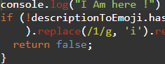
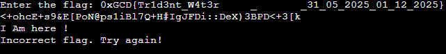
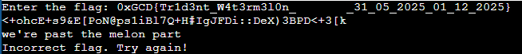

Typical Obfuscated code. Obviously the code isn't written in java because it contains terms used in javascript and we'll have to use a javascript deobfuscator : 

```javascript

const readline = require("readline");
const emojiDescriptions = {
  '❤️': "red heart",
  '🎉': "tada",
  '🍈': "melon"
};
const descriptionToEmoji = Object.fromEntries(Object.entries(emojiDescriptions).map(([_0x4ee2e7, _0x2db7fd]) => [_0x2db7fd, _0x4ee2e7]));
function stringToHex(_0x452f4d) {
  return _0x452f4d.split('').map(_0x4e9481 => _0x4e9481.charCodeAt(0x0).toString(0x10)).join('');
}
function leettoletter(_0x2dd4e5) {
  return _0x2dd4e5.replace(/4/g, 'a').replace(/3/g, 'e').replace(/1/g, 'i').replace(/0/g, 'o').replace(/5/g, 's').replace(/7/g, 't');
}
function lettertoleet(_0x164532) {
  return _0x164532.replace(/a/g, '4').replace(/e/g, '3').replace(/i/g, '1').replace(/o/g, '0').replace(/s/g, '5').replace(/t/g, '7');
}
function british(_0x137705) {
  var _0x2876e9 = "Bo'oh'o'Wa'er"[0x8] + "Bo'oh'o'Wa'er"[0x9] + "Bo'oh'o'Wa'er"[0xa] + "Bo'oh'o'Wa'er"[0xb] + "Bo'oh'o'Wa'er"[0xc];
  _0x2876e9 = _0x2876e9.replace(/a/g, '4').replace(/e/g, '3').replace(/i/g, '1').replace(/o/g, '0').replace(/s/g, '5').replace(/t/g, '7');
  _0x137705 = _0x137705.replace(/t/g, "'");
  return _0x2876e9 === _0x137705;
}
function hexToString(_0x8e4401) {
  let _0xf85090 = '';
  for (let _0x3b2101 = 0x0; _0x3b2101 < _0x8e4401.length; _0x3b2101 += 0x2) {
    _0xf85090 += String.fromCharCode(parseInt(_0x8e4401.substr(_0x3b2101, 0x2), 0x10));
  }
  return _0xf85090;
}
function checkBit(_0x41f67f) {
  if (_0x41f67f === '1' || _0x41f67f === '0') {
    return "bit";
  }
}
var secret = 'hi';
secret = secret.replace(hexToString('69'), '');
secret += String.fromCharCode(secret.charCodeAt(0x0) + 0xc).repeat(0x2);
secret += String.fromCharCode(secret.charCodeAt(0x1) - 0x4).repeat(0x1);
secret += String.fromCharCode(secret.charCodeAt(0x0) + 0xb).repeat(0x1);
secret += hexToString('3a');
secret += hexToString('2f').repeat(0x2);
secret += checkBit('1');
secret += '.';
secret += 'yl'.split('').reverse().join('');
secret += String.fromCharCode(secret.charCodeAt(0x6));
secret += atob("NDhqOGttaw==");
function checkXOR(_0x44762c) {
  let _0x172160 = "pyUx^!'.";
  let _0x3c9049 = _0x44762c[0x2] + _0x44762c[0x4];
  let _0x379a65 = btoa(_0x44762c[0x1] + _0x44762c[0x2] + _0x44762c[0x3] + _0x44762c[0x4] + _0x44762c[0x5]);
  _0x3c9049 = parseInt(_0x3c9049, 0x10);
  if (_0x3c9049 !== 19) {
    return false;
  }
  _0x172160 = stringToHex(_0x172160);
  let _0x7d6aab = Array.from(_0x379a65).map(_0x43f425 => {
    let _0x26baf8 = String.fromCharCode(_0x43f425.charCodeAt(0x0) ^ _0x3c9049);
    return _0x26baf8;
  }).join('');
  console.log("<+ohcE+s9&E[PoN@ps1iBl7Q+H#IgJFDi::DeX)3BPD<+3[k");
  return _0x7d6aab === hexToString(_0x172160);
}
function checkCapitalizationAtIndexes(_0x3a9582) {
  if (_0x3a9582.length === 0x0) {
    return false;
  }
  const _0x1298c3 = _0x3a9582[0x0] === _0x3a9582[0x0].toUpperCase();
  const _0x3eaca4 = _0x3a9582.length > 0x6 ? _0x3a9582[0x0] === _0x3a9582[0x6].toUpperCase() : false;
  const _0x27afac = _0x3a9582.length > 0xa ? _0x3a9582[0x0] === _0x3a9582[0xa].toUpperCase() : false;
  return _0x1298c3 && _0x3eaca4 && _0x27afac && _0x3a9582[0x6] === 't' && _0x3a9582[0xa] === 't';
}
function checkDateSection(_0x429874, _0x48b26a) {
  const _0x149c73 = parseInt(_0x429874.slice(0x0, 0x2));
  const _0xd77a0 = parseInt(_0x429874.slice(0x3, 0x5));
  const _0x2401d2 = parseInt(_0x429874.slice(0x6, 0xa));
  const _0x645598 = parseInt(_0x48b26a.slice(0x0, 0x2));
  const _0x42bf45 = parseInt(_0x48b26a.slice(0x3, 0x5));
  const _0x279e98 = parseInt(_0x48b26a.slice(0x6, 0xa));
  const _0x392d4e = parseInt("31 01 1984".slice(0x0, 0x2));
  const _0x32cbc5 = parseInt("31 01 1984".slice(0x3, 0x5));
  const _0x43fad9 = _0x149c73 === _0x392d4e;
  const _0x11a5a0 = _0x645598 === _0x32cbc5;
  const _0x35c315 = parseInt('' + _0x645598 + (_0x645598 + 0x1));
  const _0xa7d05f = _0x279e98 === 0x7e9;
  const _0x2dab20 = new Date(_0x2401d2, _0xd77a0 - 0x1, _0x149c73);
  const _0xbb6414 = new Date(_0x279e98, _0x42bf45 - 0x1, _0x645598);
  const _0x3693fd = Math.floor((_0xbb6414 - _0x2dab20) / 0x5265c00);
  return _0x3693fd === 0xb8 && _0x43fad9 && _0x11a5a0 && _0x42bf45 === _0x35c315 && _0xa7d05f;
}
function validateFlag(_0x3fc863) {
  const _0x20b555 = stringToHex(_0x3fc863.slice(0x0, 0x6));
  const _0xc8a79a = stringToHex(_0x3fc863.slice(-0x1));
  if (_0x20b555 !== "30784743447b" || _0xc8a79a !== '7d') {
    return false;
  }
  if (_0x3fc863.length !== (atob("NTU=").repeat(0x1b) + 0x1).length) {
    return false;
  }
  const _0x51bec2 = _0x3fc863.slice(0x6, -0x1);
  const _0x1d1742 = [0x7, 0x12, 0x1a, 0x1d, 0x20, 0x25, 0x28, 0x2b];
  for (let _0x436229 of _0x1d1742) {
    const _0x107836 = _0x51bec2[_0x436229];
    _0x107836.charCodeAt(atob("MA==")) != hexToString('5f').charCodeAt(0x0);
    if (_0x107836.charCodeAt(0x0) != 0x5f || _0x107836.charCodeAt(0x0) < 0x5f || _0x107836.charCodeAt(atob("MA==")) != hexToString('5f').charCodeAt(0x0)) {
      return false;
    }
  }
  const _0x52d033 = _0x51bec2.slice(0x1b, 0x25);
  const _0x19e058 = _0x51bec2.slice(0x26, 0x30);
  if (!checkDateSection(_0x52d033, _0x19e058)) {
    return false;
  }
  if (String.fromCharCode(_0x51bec2.charCodeAt(0x0) - 0xd) !== _0x3fc863[0x2]) {
    return false;
  }
  if (!checkCapitalizationAtIndexes(_0x51bec2)) {
    return false;
  }
  if (!checkXOR(_0x51bec2)) {
    return false;
  }
  if (!british(_0x51bec2[0x8] + _0x51bec2[0x9] + _0x51bec2[0xa] + _0x51bec2[0xb] + _0x51bec2[0xc])) {
    return false;
  }
  if (!descriptionToEmoji.hasOwnProperty((_0x51bec2[0xd] + _0x51bec2[0xe] + _0x51bec2[0xf] + _0x51bec2[0x10] + _0x51bec2[0x11]).replace(/4/g, 'a').replace(/3/g, 'e').replace(/1/g, 'i').replace(/0/g, 'o').replace(/5/g, 's').replace(/7/g, 't'))) {
    return false;
  }
  if (stringToHex(_0x51bec2.slice(0x13, 0x1a).replace(/4/g, 'a').replace(/3/g, 'e').replace(/1/g, 'i').replace(/0/g, 'o').replace(/5/g, 's').replace(/7/g, 't')) !== "466c61766f7572") {
    return false;
  }
  return true;
}
const rl = readline.createInterface({
  'input': process.stdin,
  'output': process.stdout
});
rl.question("Enter the flag: ", _0x333ccb => {
  if (validateFlag(_0x333ccb)) {
    console.log("Congratulations! You've entered the correct flag.");
  } else {
    console.log("Incorrect flag. Try again!");
  }
  rl.close();
});

```

There are multiple ways to solve this challenge but it all boils down to understanding the code, I personally used a mixture of z3 solver,pen and paper, and console logging techniques to solve the challenge, You'll have to go line by line (unfortunately) : 

```python
import base64
from z3 import *

def create_z3_flag_solver():
    # Flag is 55 characters long, starting with '0xGCD{' and ending with '}'
    flag_chars = [BitVec(f'flag_{i}', 8) for i in range(55)]  # Create 55 variables for each character
    
    s = Solver()

    # Prefix and suffix constraints (fixed part of the flag)
    s.add(flag_chars[0] == ord('0'))
    s.add(flag_chars[1] == ord('x'))
    s.add(flag_chars[2] == ord('G'))
    s.add(flag_chars[3] == ord('C'))
    s.add(flag_chars[4] == ord('D'))
    s.add(flag_chars[5] == ord('{'))
    s.add(flag_chars[54] == ord('}'))  # End of the flag
    
    # Set underscores at specific positions (without the +6)
    underscore_indexes = [7+6, 18+6, 26+6, 29+6, 32+6, 37+6, 40+6, 43+6]
    for idx in underscore_indexes:
        s.add(flag_chars[idx] == ord('_'))  # Place the underscore correctly at specified indexes
    
    for i in range(55):
        s.add(And(flag_chars[i] >= 32, flag_chars[i] <= 126))  # ASCII printable characters (32 to 126)

    s.add(flag_chars[33]==ord("3"))
    s.add(flag_chars[34]==ord("1"))
    s.add(flag_chars[36]==ord("0"))
    s.add(flag_chars[37]==ord("5"))
    s.add(flag_chars[39]==ord("2"))
    s.add(flag_chars[40]==ord("0"))
    s.add(flag_chars[41]==ord("2"))
    s.add(flag_chars[42]==ord("5"))
    s.add(flag_chars[44]==ord("0"))
    s.add(flag_chars[45]==ord("1"))
    s.add(flag_chars[47]==ord("1"))
    s.add(flag_chars[48]==ord("2"))
    s.add(flag_chars[50]==ord("2"))
    s.add(flag_chars[51]==ord("0"))
    s.add(flag_chars[52]==ord("2"))
    s.add(flag_chars[53]==ord("5"))

    s.add(flag_chars[6] - 0xd == flag_chars[2])

    s.add(flag_chars[12]==ord('t'))
    s.add(flag_chars[16]==ord('t'))
    s.add(flag_chars[8]==ord('1'))
    s.add(flag_chars[10]==ord('3'))
    #flag from 7 to 12 is "r1d3n"
    s.add(flag_chars[7]==ord('r'))
    s.add(flag_chars[9]==ord('d'))
    s.add(flag_chars[11]==ord('n'))
    # Ensure all flag characters are printable
    #flag from 15 to 19 is "W4t3r"
    s.add(flag_chars[14]==ord('W'))
    s.add(flag_chars[15]==ord('4'))
    s.add(flag_chars[16]==ord('t'))
    s.add(flag_chars[17]==ord('3'))
    s.add(flag_chars[18]==ord('r'))

    
        

    # Check if solver can find a solution
    if s.check() == sat:
        m = s.model()
        flag_solution = ''.join(chr(m.evaluate(flag_chars[i]).as_long()) for i in range(55))
        print("Potential Flag:", flag_solution)
        return flag_solution
    else:
        print("No solution found")
        return None

# Run the solver
create_z3_flag_solver()

```

Result : Potential Flag: 0xGCD{Tr1d3nt_W4t3r     _       _31_05_2025_01_12_2025}

Then I added console logs to check what stage I am at : 





Then to give an example of how I read the code I see that the next function calls "descriptionToEmoji" which contains 3 emojis, if my string starts with W4t3r I'd assume it ends with melon, I see we're using regex to replace 4 with a, 3 with e, so melon must be in leet code, so our next string is m3l0n : 



then the final check validates if our string is equal to "466c61766f7572" which equals to Flavour, and is in leetcode : 

```0xGCD{Tr1d3nt_W4t3rm3l0n_Fl4v0ur_31_05_2025_01_12_2025}```


