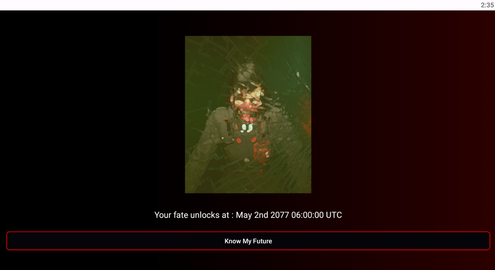
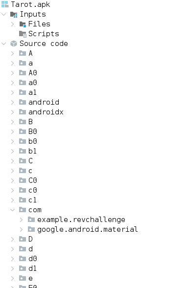
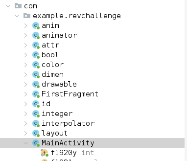
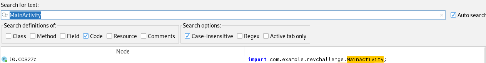
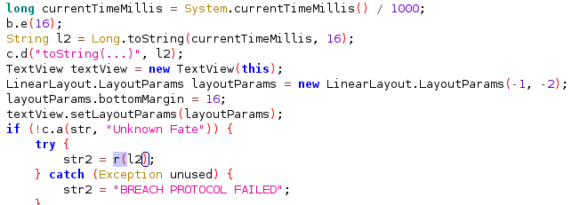
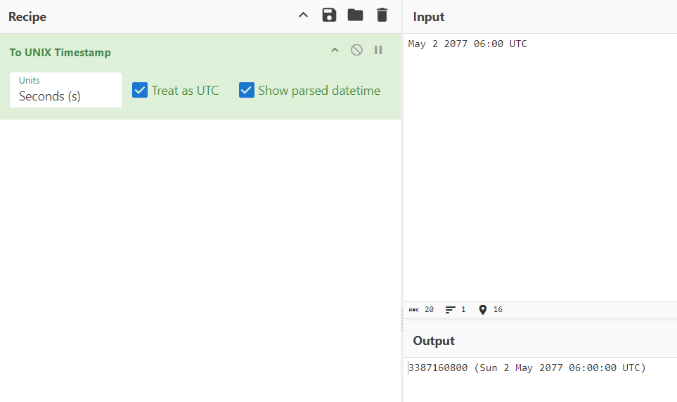
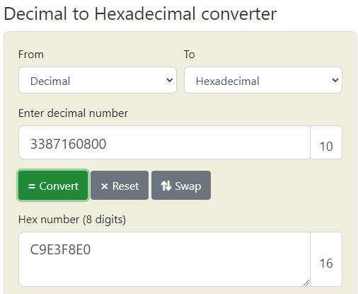
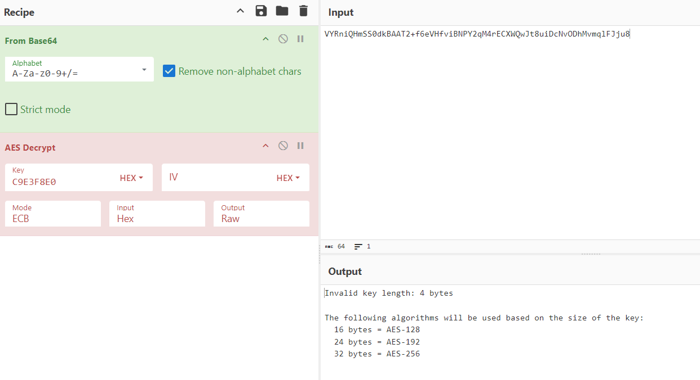
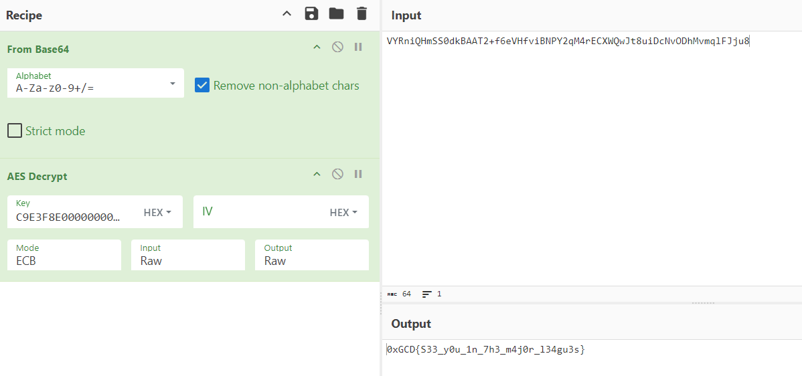

Use an emulator to run the apk (bluestacks for example) : 



This one is an android app, we can use either apktools or jadx to extract the code : 



Main is usually in com : 



Alternatively we can search for Main (MainActivity) :



Then analyze the code, you'll find a weird base64 string in this function called r : 

```java
public static String r(String str) {
        int i2;
        int i3;
        boolean z2;
        int i4;
        int length = str.length();
        int i5 = length / 2;
        if (length % 2 == 0) {
            i2 = 0;
        } else {
            i2 = 1;
        }
        ArrayList arrayList = new ArrayList(i5 + i2);
        int i6 = 0;
        while (i6 >= 0 && i6 < length) {
            int i7 = i6 + 2;
            if (i7 >= 0 && i7 <= length) {
                i4 = i7;
            } else {
                i4 = length;
            }
            CharSequence subSequence = str.subSequence(i6, i4);
            c.e("it", subSequence);
            arrayList.add(subSequence.toString());
            i6 = i7;
        }
        ArrayList arrayList2 = new ArrayList(arrayList.size());
        Iterator it = arrayList.iterator();
        while (it.hasNext()) {
            String str2 = (String) it.next();
            b.e(16);
            arrayList2.add(Byte.valueOf((byte) Integer.parseInt(str2, 16)));
        }
        int size = arrayList2.size();
        byte[] bArr = new byte[size];
        Iterator it2 = arrayList2.iterator();
        int i8 = 0;
        while (it2.hasNext()) {
            bArr[i8] = ((Number) it2.next()).byteValue();
            i8++;
        }
        int i9 = 16 - size;
        byte[] copyOf = Arrays.copyOf(bArr, size + i9);
        System.arraycopy(new byte[i9], 0, copyOf, size, i9);
        c.b(copyOf);
        SecretKeySpec secretKeySpec = new SecretKeySpec(copyOf, "AES");
        Cipher cipher = Cipher.getInstance("AES/ECB/PKCS5Padding");
        cipher.init(2, secretKeySpec);
        byte[] doFinal = cipher.doFinal(Base64.decode("VYRniQHmSS0dkBAAT2+f6eVHfviBNPY2qM4rECXWQwJt8uiDcNvODhMvmqlFJju8", 0));
        c.b(doFinal);
        String str3 = new String(doFinal, a.f1911a);
        int length2 = str3.length() - 1;
        int i10 = 0;
        boolean z3 = false;
        while (i10 <= length2) {
            if (!z3) {
                i3 = i10;
            } else {
                i3 = length2;
            }
            char charAt = str3.charAt(i3);
            if (!Character.isWhitespace(charAt) && !Character.isSpaceChar(charAt)) {
                z2 = false;
            } else {
                z2 = true;
            }
            if (!z3) {
                if (!z2) {
                    z3 = true;
                } else {
                    i10++;
                }
            } else {
                if (!z2) {
                    break;
                }
                length2--;
            }
        }
        return str3.subSequence(i10, length2 + 1).toString();
    }
```

Decoding the base64 gives us nothing. Since AES/ECB/PKCS5Padding is mentioned we must assume that it is encrypted with AES.

But what's the key ? We have a variable called secretKeySpec, which uses the variable copyOf, which uses bArr, which uses it2, which uses arrayList2 ! Which uses arrayList ! Which uses subSequence !!!! which uses...str, the parameter of our function.

So we'll simply need to see where our function is being called : 



Our function uses l2, which is the currentTimeMillis divided by 1000 (ms to s), then Long.toString(currentTimeMillis, 16) converts our string to hex.

So now we know our key is related to time. The description of the challenge hints that the relic is from the future, and the interface of our app hints that the correct date is May 2nd 2077 at 06:00 UTC

We can simply take our encoded flag and decode it online (or use a script) : 







We're missing 12 bytes so we'll add a padding of 0s : 



Done.


