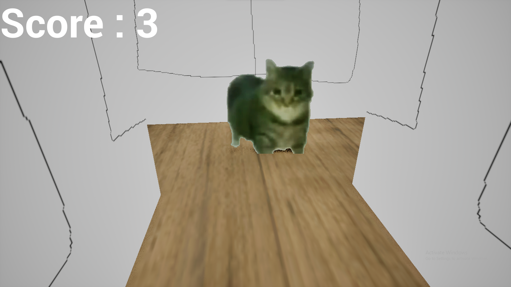
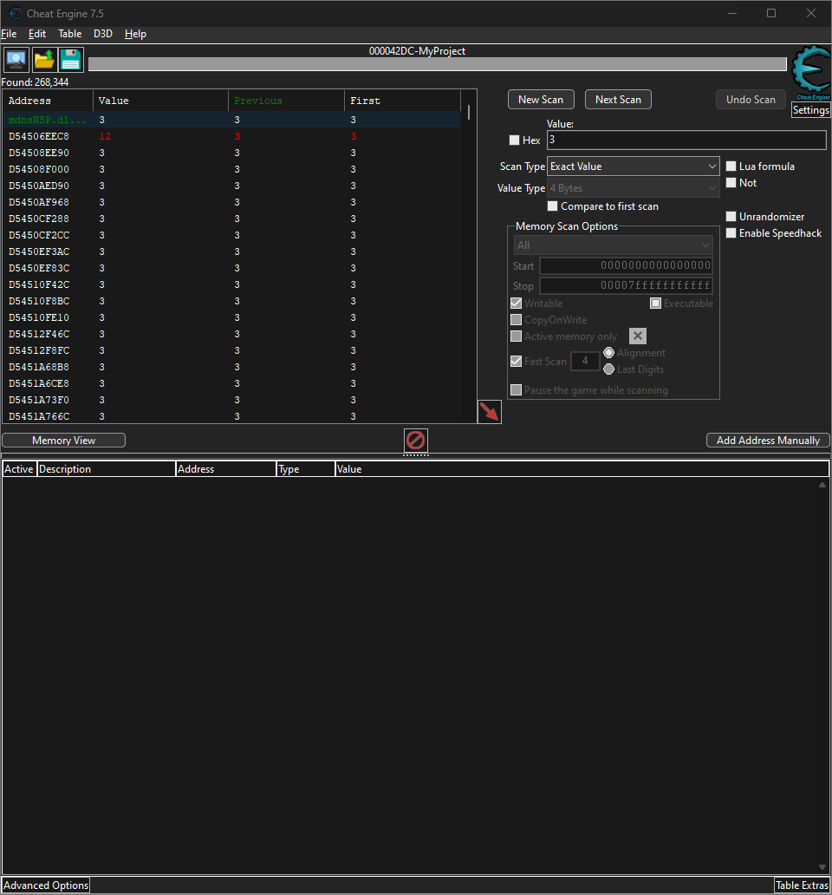
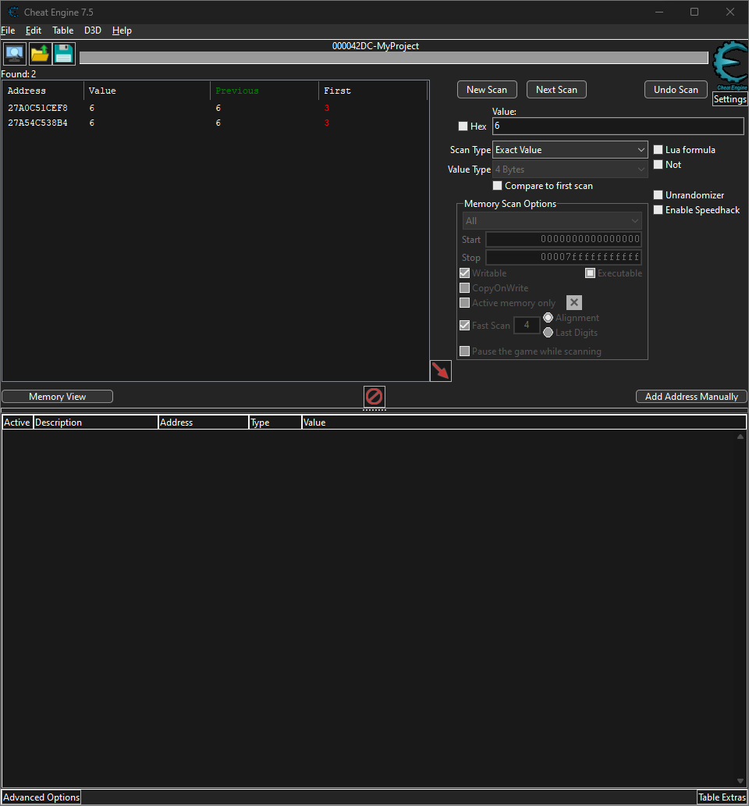
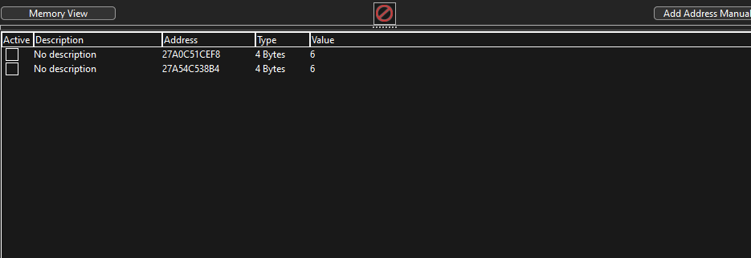
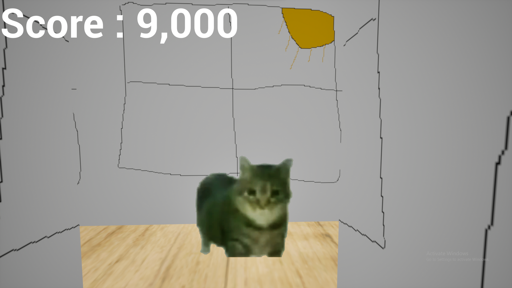

This one follows almost the same steps that I've shown in the bootcamp when I explained how to use cheat engine to hack games and modify values :

"Do not pet the specimen 9000 times"...I'm going to pet the specimen 9000 times.

My score is currently at 3 : 

I'll use cheat engine to look up this value : 

A whole lot of 3s pop up, I need to keep filtering, what I'll do is I'll pet the cat again, increment the score and do "next scan" until I have a couple candidates left : 

Let's modify these two by adding them to our addresslist :

Then let's modify both values to 9000 : 

Perfect ! our score is now at 9000 : 

Then you'll get your flag but you'll keep falling forever, that's why you shouldn't pet whatever that thing is 9000 times... 

Trick : cheat engine comes with a built in speedhack script, you can use it to slow down time and read the flag with ease.