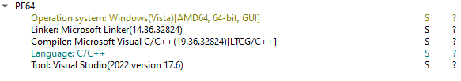
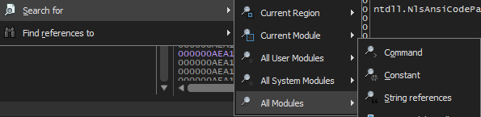
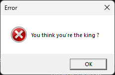
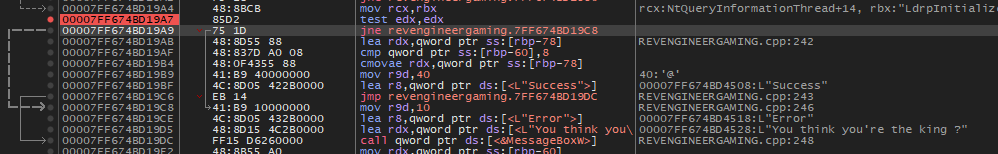
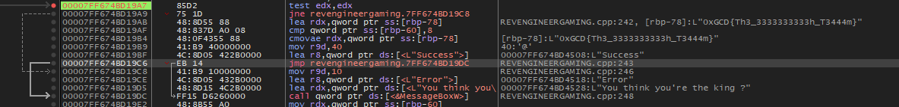

Same as pet the specimen, I've already demonstrated how to solve a challenge like this during the bootcamp, the app is a windows desktop app : 

We can use x64dbg to debug our program and get the flag. Use the "search for" command and look for strings in all module : 

We'll search for this error : 

The arrows on the left can help us understand find the condition that validates our input : 

Which is these two lines : 

00007FF674BD19A7 | 85D2                     | test edx,edx                            |
00007FF674BD19A9 | 75 1D                    | jne revengineergaming.7FF674BD19C8      |

So I'll put a breakpoint here and see what'll happen when I reach this part after I input my credentials (Almost like that one web challenge): 

And there it is, in plain sight.