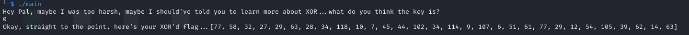
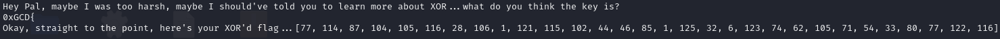
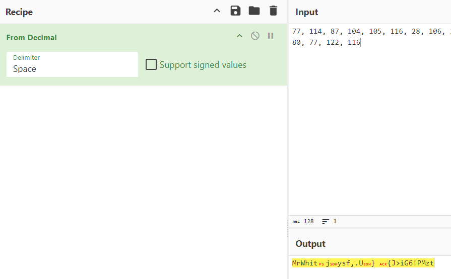
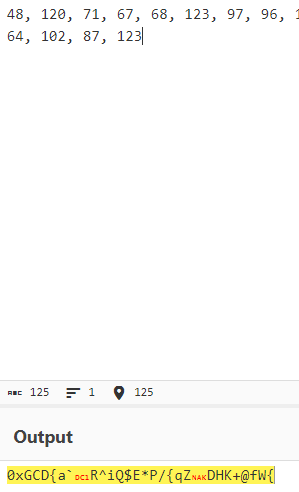
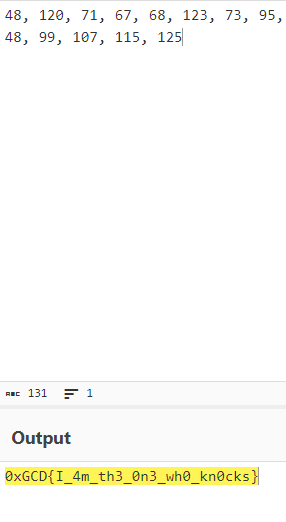

This program was made in rust, which is hard to decompile, I rewrote the description and the program to make it less guessy : 

We're getting a "XOR'd flag". We know that we can reverse XOR operations if we partially know the string, all flags start with 0xGCD{ soo we'll try that :

We'll have to convert these results to a string : 

We get one part of the key and it starts with MrWhit, let's use it : 

Close, but no cigar. We need one more element, this is the part where you'll have to guess that the key is MrWhite : 

