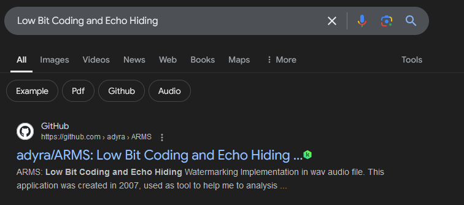
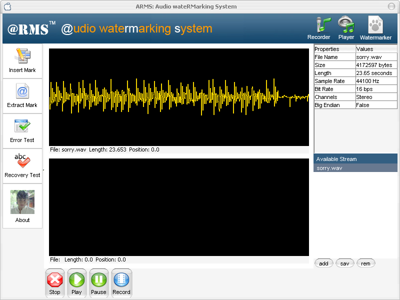
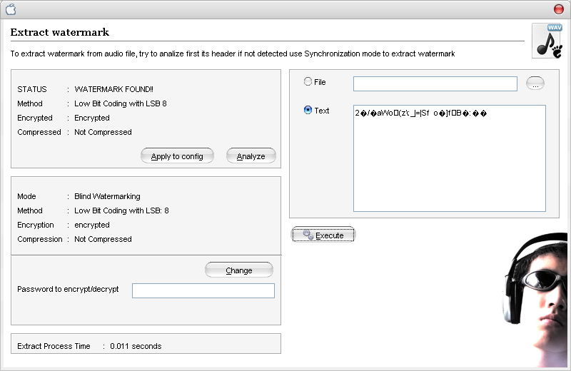
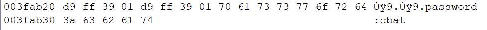
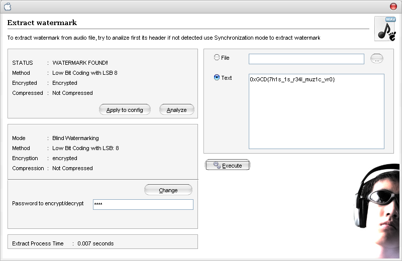

In the description of the challenge I mentioned Echo and LSB, I realized it was a bit too guessy so I gave a hint about Low Bit Coding and Echo Hiding : 

first link leads to a program that can extract the flag :

Here it says that there is in fact a hidden text in our wav file...But it is encrypted with a password :

If you check the strings in the file you'll find this hint : 

So, using this password we can get our flag : 

