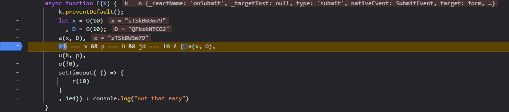

This challenge requires you to input the right credentials to login, except the "right" credentials are randomly generated as you click login.

The vulnerability here is that we have access to the javascript :


I added a console log to help players find the login function : 


With javascript you can put breakpoints and debug the code :



x and D are the "right" credentials, since we're in debug mode and x and D aren't const we can change them to be equal to our inputs (1 and 1 for example): 


But we're not done yet, we still have a variable called jd that must not equal to 0, it is set to false, we'll simply make it true : 


Resuming the script gives us the flag in the console : 

```0xGCD{4_b3dr00m_w1nd0w_m4d3_0u7_0f_br1ck5}```